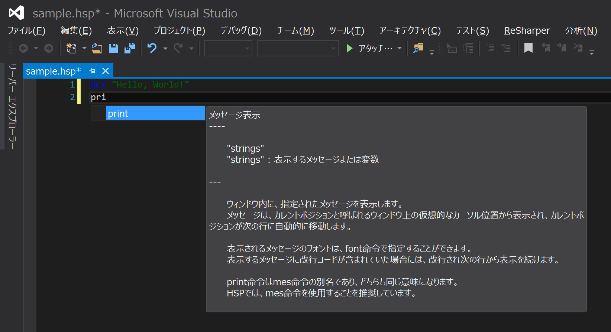

# hsp.vs
Visual Studio 2015で開かれた.hspファイルに対して簡単なサジェスト機能を提供します

## Usage
1. [Release](https://github.com/kkrnt/hsp.vs/releases/tag/v0.1.0)からhsp.vs.vsixをダウンロードする
2. Visual Studio 2015がインストールされているコンピュータ上でhsp.vs.vsixを実行する
3. インストーラの指示に従ってインストールを行う
4. インストール後, Visual Studioを再起動し, .hspファイルを開くと機能する

## Example

## LICENSE
[MIT LICENSE](LICENSE)

## Related Projects
[mimura1133/YamahaConfigClassifier](https://github.com/mimura1133/YamahaConfigClassifier)を参考にさせて頂きました  
MIT LICENSE  
 
[zakki/openhsp](https://github.com/zakki/openhsp)のヘルプドキュメントを参考にさせて頂きました  
[LICENSE](https://github.com/zakki/openhsp/blob/master/License_j.txt)